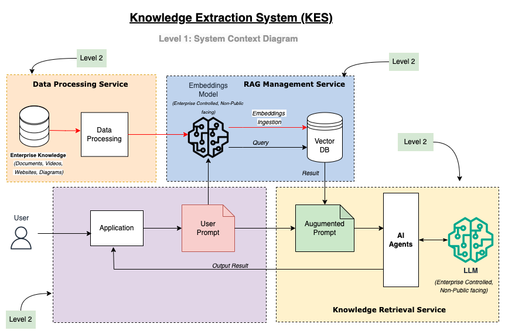
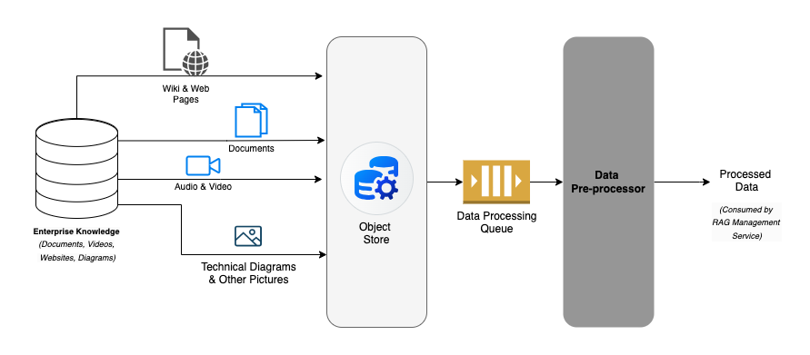
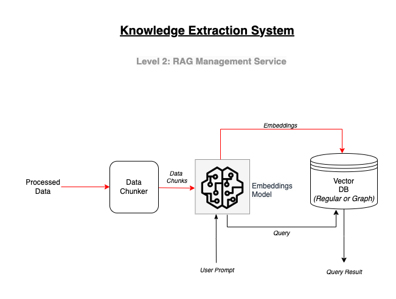
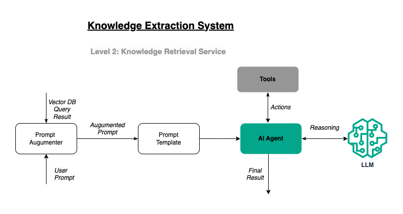

# Knowledge Extraction System.

## 1.0: Problem Statement.
In the most basic sense, LLMs are a useful piece of technology for encoding information. Trained on vast datasets to understand and generate human-like text, they excel in extracting and synthesizing knowledge from diverse sources, making them powerful for information retrieval. However, LLMs can struggle with providing precise and relevant information within user prompts due to potential biases, overfitting, and lack of specific context. Privacy concerns arise as LLMs may inadvertently retain and expose sensitive data from their training sets, risking user confidentiality and data security. When organizations use 3rd LLM API, there is also a risk of providing proprietary to the model that can later be used to train it.

Although a very versatile tool for any domain, these issues limit its rate of adoption at the enterprise.

## 2.0: Solution.
This project aims to provide a template for the adoption of AI, specifically LLMs, for various enterprise tasks, addressing the identified risks and challenges to some extent. Key strategies include:

**Retrieval-Augmented Generation (RAG)**: RAG can be leveraged to create augmented prompts that provide better context for LLM outputs, improving the relevance and accuracy of the generated information.

**Prompt Engineering**: Crafting well-structured prompts can set clear boundaries for LLMs, enabling them to operate within defined parameters and produce more relevant results. When combined with AI agents, well-engineered prompts can drive efficient task completion and workflow creation.

**Privacy Measures**: Privacy concerns can be mitigated by deploying LLMs locally within an organization, ensuring that the models are governed by the same access controls as other IT systems. Whether deployed on-premises or in a controlled cloud environment, this approach helps safeguard sensitive information.

By implementing these strategies, enterprises can significantly mitigate (though not eliminate) the challenges associated with LLM adoption, paving the way for more secure and effective use of AI in their operations.

## 3.0 System Summary.
The solution developed to address these challenges is code-named the Knowledge Extraction System (KES). KES leverages Retrieval-Augmented Generation (RAG) and sophisticated prompt engineering with AI agents to create a robust framework that accomplishes specific tasks while delivering highly relevant outputs. The KES framework simplifies the process of ingesting additional data into RAG and facilitates the creation of AI agents, referred to as "crew," each tailored to perform distinct tasks.

The output from any crew is contextually relevant information, produced through well-crafted prompts that guide each agent’s work. This output consolidates data from multiple sources, ensuring that the final result is comprehensive and precise. By utilizing RAG, KES significantly reduces the risk of hallucinations or the LLM relying solely on its training data, making the information it provides more accurate and dependable.

KES is versatile and can be adopted across various domains where there is a need for context-specific, relevant information with minimal risk of inaccuracies.

## 4.0: System Architecture.
The architecture diagram below illustrates the different layers and complexities of the application. Level 1 presents a high-level overview, while subsequent levels (Level 2) delve into specific components to provide more detailed information.

#### 4.1: Level 1 - System Context.

This provide a high level view of the system and its components.

#### 4.2: Level 2 - Data Processing Service. Container

The goal of this service is to extract information from all enterprise sources or knowledge bases. As data is placed in an object store, an event is fired that places the data in a queue for processing. The data pre-processor takes the data off the queue and processes it according to the data type (document, picture, audio, or video).

#### 4.3: Level 2 - RAG Management Service Container.

The data from the Data Processing Service is sent here. The data is first chunked according to a pre-determined chunking metric. Embedding is created from this chunk and saved in a vector database (Postgres with PG Vector in the current case).

#### 4.4: Level 2 - Knowledge Retrieval Service Container.

The Knowledge Retrieval Service uses augmented prompts with specialized AI agents to get the best answer for a task assigned.

## 5.0: Use Cases

As previously mentioned, KES can be used in any domain for any task that requires information with a reasonable amount of context and fewer generated ideas. Below are some use cases developed or currently being explored:

**Use Case 1:   Security Architect KES**:

A security architect performs many tasks that contribute to the security of enterprise software systems. Some of those include Security Review, Code Review, and Threat Modeling. To properly perform these tasks, the Security Architect needs a detailed context of the application being reviewed in various dimensions. The use of "various dimensions" here means all the information the Security Architect needs to gather to perform their tasks.
This includes:
- System Understanding
- System Components Information
- Data Dictionary
- Trust Boundaries
- Threat Scenarios
- Countermeasures

To use KES to perform the tasks of a Security Architect, one needs to be able to provide the LLM with the following contextual information:
- Initial prompt: This will be in the form of an architectural diagram or detailed system description
- Enterprise Security Requirements: These are the high-level security requirements defined by the product security team. The generic security requirements serve to guide security reviews in various domains. These will include Data Transfer Security Requirements, Network Security Requirements, Cloud Security Requirements, IAM Security Requirements, etc. Each of these is organization and (sometimes product) specific.
- Governance, Risk, and Compliance (GRC) Policies: These are policies defined by the GRC team to provide governance and compliance guidance.

By providing contextual information through RAG and utilizing an AI agent to orchestrate the steps for each task, one can easily scale some of a security architect's tasks.

**Use Case 2: Security Test KES**:

WIP

**Use Case 3: Real Estate Analysis KES**:

WIP
