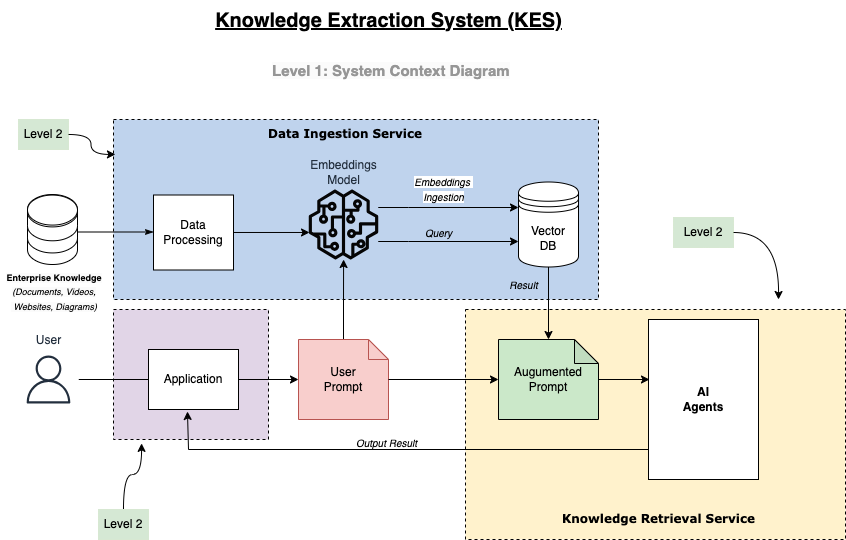
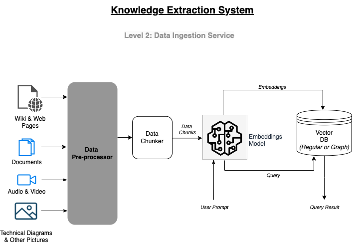
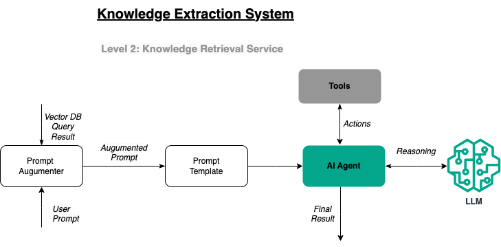

# Knowledge Extraction System
This repository contains various components of the Knowledge Extraction System (KES). The KES is designed to deliver relevant in-context information based on user prompts or questions. The final result presented to the user consolidates information from multiple sources. By leveraging Retrieval-Augmented Generation (RAG), the system ensures that the information provided is highly relevant, minimizing the risk of hallucinations or the LLM relying solely on its training data.

## 1.0 System Architecture
The architecture diagram below illustrates the different layers and complexities of the application. Level 1 presents a high-level overview, while subsequent levels (Level 2) delves into specific components to provide more detailed information.

#### 1.1 Level 1 - System Context


#### 1.2 Level 2 - Data Ingestion Service Container


#### 1.3 Level 2 - Knowledge Retrieval Service Container



## 2.0 Deployment
This repository provides a local deployment setup for a Large Language Model (LLM) using Docker and Docker Compose. The setup uses ollama LLM with Open Web UI.


### 2.1 Setup and Deployment

To run locally
- Run  `make start` at the root of this project. This will setup Open Web UI for chatting and deploys it with `llama3` model. 
- ~~ To setup this stack with a different LLM like say `gemma2`, issue this command `make start LOCAL_LLM=gemma2` ~~

#### 2.1.1 Chat UI
2. To access the chat UI, got to `http://localhost:3000`
3. Sign up with a local account and login (Login information is local to the host machine).
4. Select a model to use for chat.
5. Chat away :)

#### 2.1.2 API Access.
Ollama exposes some endpoint that one can use to intereact with the LLM model.
Some examples are below:

**Chat Endpoint**
```
$ curl http://localhost:11434/api/generate -d '{
  "model": "llama3",
  "prompt":"Why is the sky blue?"
}'
```

**Pull Model**
One can use multiple model in the Open Web UI. To pull a model run

`curl http://localhost:11434/api/pull -d '{"name": "llama3"}'`

**Check Models Avalible locally**
`curl http://localhost:11434/api/tags`

#### 2.2 LANGFLOW
https://github.com/langflow-ai/langflow/tree/main/docker_example

#### 2.3 RAG
To deploy the RAG, run `make rag`. This will start the RAG service at `http://localhost:7860`

 