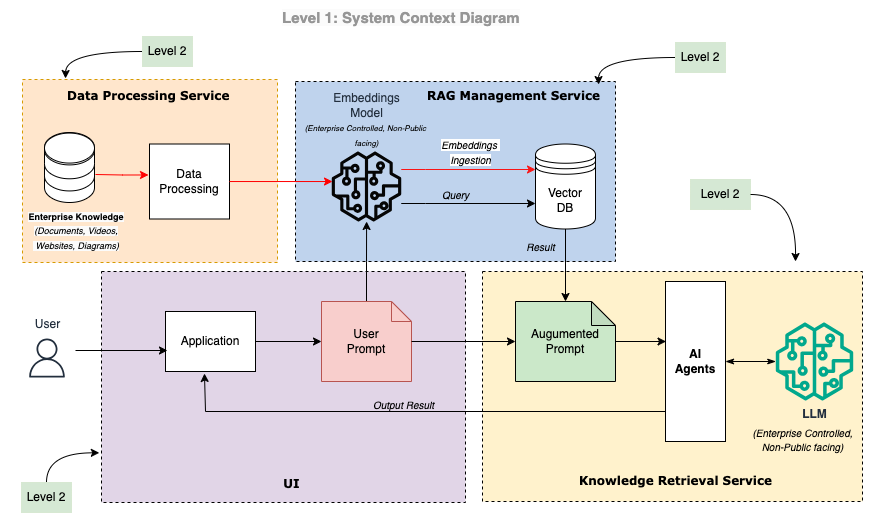

# SECAD

## Summary
SECAD is an **agentic, AI-powered** security workflow augmentation application.

For more details read this article on the use case of the project: 
https://medium.com/@gideonaina/workflow-augmentation-with-multi-agent-ai-system-3c3223c948dc

## System Architecture.
The architecture diagram below illustrates the different layers and complexities of the application.

#### Level 1 - System Context.

This provide a high level view of the system and its components.

#### Level 2 - Data Processing Service. Container

The goal of this service is to extract information from all enterprise sources or knowledge bases. As data is placed in an object store, an event is fired that places the data in a queue for processing. The data pre-processor takes the data off the queue and processes it according to the data type (document, picture, audio, or video).

#### Level 2 - RAG Management Service Container.

The data from the Data Processing Service is sent here. The data is first chunked according to a pre-determined chunking metric. Embedding is created from this chunk and saved in a vector database (Postgres with PG Vector in the current case).

#### Level 2 - Knowledge Retrieval Service Container.

The Knowledge Retrieval Service uses augmented prompts with specialized AI agents to get the best answer for a task assigned.